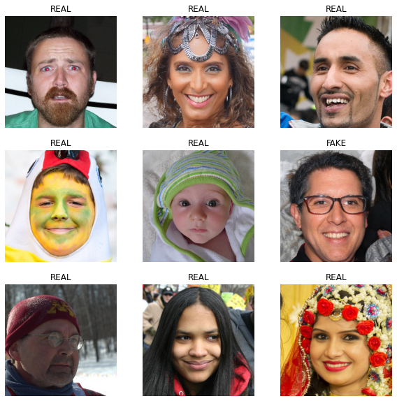
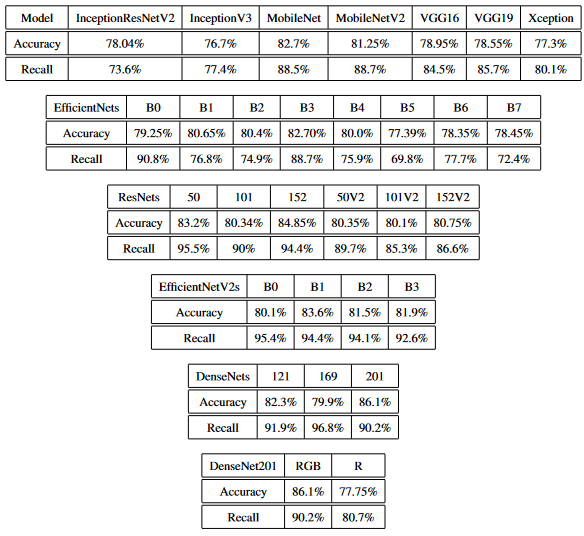

# Deepfake-Fiesta

This project is a comparative study on the performance of multiple transfer learning models in deepfake detection. The dataset used in this project is split into a training set of 100k images, a test set of 20k images, and a validation set of 20k images.

## Models Tried

The following transfer learning models were tried for deepfake detection:

- InceptionResNetV2
- InceptionV3
- MobileNet
- MobileNetV2
- VGG16
- VGG19
- Xception
- EfficientNetB0
- EfficientNetB1
- EfficientNetB2
- EfficientNetB3
- EfficientNetB4
- EfficientNetB5
- EfficientNetB6
- EfficientNetB7
- ResNet50
- ResNet101
- ResNet152
- ResNet50V2
- ResNet101V2
- ResNet152V2
- EfficientNetV2B0
- EfficientNetV2B1
- EfficientNetV2B2
- EfficientNetV2B3
- DenseNet121
- DenseNet169
- DenseNet201

Here are the results

## Google Colab Links
[Main Code](https://colab.research.google.com/drive/1IQeCgeo0eQXN7zN-G1Tind6hJBMdtqW_?usp=sharing)

## Requirements
The project requires Python 3.5 or later and the following libraries:

- NumPy
- Tensorflow
